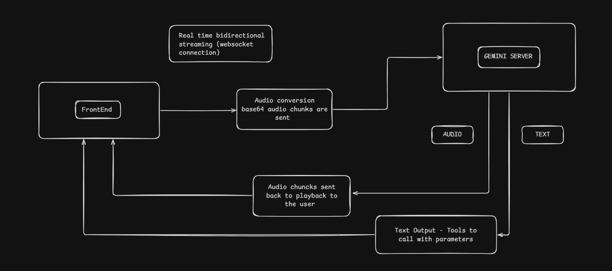

# VoiceScribe

A real-time voice assistant that enables students to take exams using voice commands. This voice agent is built using Gemini Live API for low-latency real-time audio streaming and function calling.

---

##  Features 

### Voice Accessibility for Students
- Helps students with visual impairments , motor disabilities , or physical challenges to take exams using voice commands ( hands-free ) .

### Exam Guardrails and Anti-Cheating Protocol
- Has strict Exam guardrails and Anti - cheating protocol.For example if a user asks [What is the answer ?] or [Give me the answer for this question] it strictly refuses to answer.
- It can help the students in understanding the question but never provides hints or directly gives the answer for a particular question.

### Real Time LaTeX Rendering for Math and Science Questions
- Translates spoken mathematical expressions or scientific notations into LaTeX and it is rendered in real time.

### Seperate Role-Based Dashboards for Teachers and Students
- Teachers can create question papers and assign them to specific classes or students.
- Teachers can track student's answer sheets.


---

##  WorkFlow 

### 1. Ephemeral Token Generation: 
The backend generates a short-lived ephemeral token via the Gemini REST API using the server-side API key. This token is passed to the client (FrontEnd) and used to authenticate the Websocket Session avoiding the exposure of the API key on the client side.

### 2. WebSocket Connection: 
When the mic is enabled a bidirectional WebSocket is established to Google's Gemini Live server. The WebSocket connection is established from the Client (FrontEnd) to the Gemini Live server.

### 3. Setup Message: 
Once the WebSocket connection is established a setup message (which includes system prompt and tool definitions) is sent. 

    Setup Message Consists of the following things:
    - Its job description and instructions to follow
    - Form fields that are available and need to be filled
    - Available tools and when to use those tools with the tool descriptions 


### 4. Real-Time Bidirectional Audio Streaming: 
When the user speaks audio chunks are streamed from the client to the server through WebSocket. Audio chunks from Gemini server are streamed back to the user through the WebSocket. 

### 5. Concurrent Audio & Tool Call Response: 
Gemini understands the user's intent and then calls the required tools. Gemini sends both audio and text as output. Audio is streamed back to the user through the WebSocket. The text output contains which tools to call with it's parameters. 

### 6. Client-Side Function Execution: 
The provided parameters are used to call the function and the output is sent back to the Gemini Server through the WebSocket if required and the UI is updated in real-time. 

### 7. End-to-End Example: Filling a Field: 
When the Agent asks [ What is your name ? ] . User replies [ My name is xyz ] . Gemini decides to call fill_form_fields tool and passes name as parameter with value xyz. The function is executed and the tool response is sent back to the Gemini Server and the UI state is updated in real time.



---

## Setup

### 1. Environment Variables

Create a `.env` file inside the `Backend/` directory:

```env
GEMINI_API_KEY="Your Gemini API key"
```

### 2. Backend Setup
```bash
cd Backend

npm install

npm run dev
```

### 3. Frontend Setup
```bash
cd Frontend

npm install

npm run dev
```
---

## Project Structure

```text
.
├── assets
│   ├── architecture.png
│   └── systemPrompt.png
├── Backend
│   ├── controllers
│   │   ├── Form
│   │   │   ├── downloadControllers.js
│   │   ├── authController.js
│   │   ├── formController.js
│   │   └── liveTokenController.js
│   ├── models
│   │   └── formFields.js
│   ├── routes
│   │   ├── authRoute.js
│   │   ├── FormRoute.js
│   │   └── LiveRoute.js
│   ├── template
│   │   ├── templatePDFs
│   ├── uploads
│   │   └── papers.json
│   ├── .env.example
│   ├── package.json
│   └── server.js
├── Frontend
│   ├── public
│   │   ├── favicon.svg
│   │   └── icons.svg
│   ├── src
│   │   ├── components
│   │   │   ├── ExamCompletedScreen.jsx
│   │   │   ├── FormList.jsx
│   │   │   ├── Header.jsx
│   │   │   ├── LatexRenderer.jsx
│   │   │   ├── Livewaveform.jsx
│   │   │   ├── Login.jsx
│   │   │   ├── Objective.jsx
│   │   │   ├── Subjective.jsx
│   │   │   ├── TeacherDashboard.jsx
│   │   │   └── VoiceFooter.jsx
│   │   ├── context
│   │   │   └── AuthContext.jsx
│   │   ├── hooks
│   │   │   ├── geminiConfig.js
│   │   │   ├── geminiMessageParser.js
│   │   │   ├── geminiPrompts.js
│   │   │   ├── geminiTokenManager.js
│   │   │   ├── geminiToolHandlers.js
│   │   │   ├── geminiTools.js
│   │   │   ├── useAudioPlayback.js
│   │   │   ├── useAudioRecorder.js
│   │   │   ├── useForm.js
│   │   │   ├── useFormFields.js
│   │   │   ├── useGeminiLive.js
│   │   │   └── useQuestionNavigation.js
│   │   ├── lib
│   │   │   └── utils.js
│   │   ├── utils
│   │   │   ├── audioUtils.js
│   │   │   └── waveformUtils.js
│   │   ├── App.jsx
│   │   ├── config.js
│   │   ├── Frontpage.jsx
│   │   ├── index.css
│   │   └── main.jsx
│   ├── .env.example
│   ├── eslint.config.js
│   ├── index.html
│   ├── package.json
│   ├── vercel.json
│   └── vite.config.js
├── LICENSE
├── LoopHole.md
└── README.md
```

